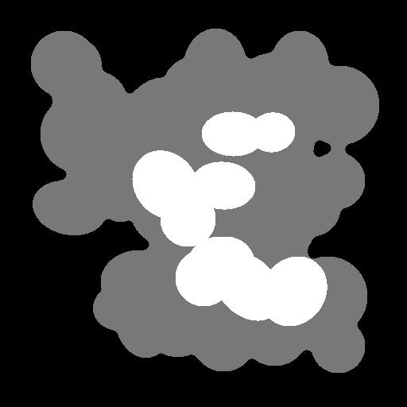
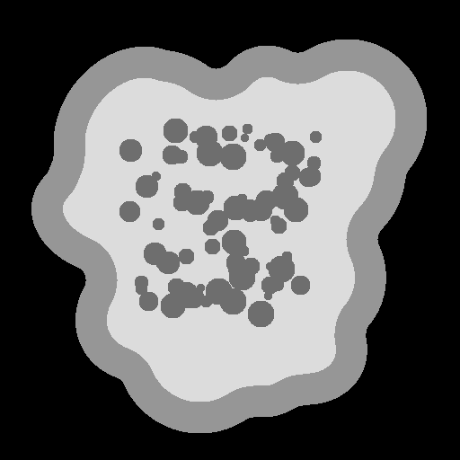
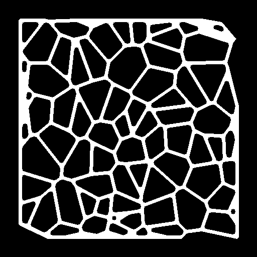
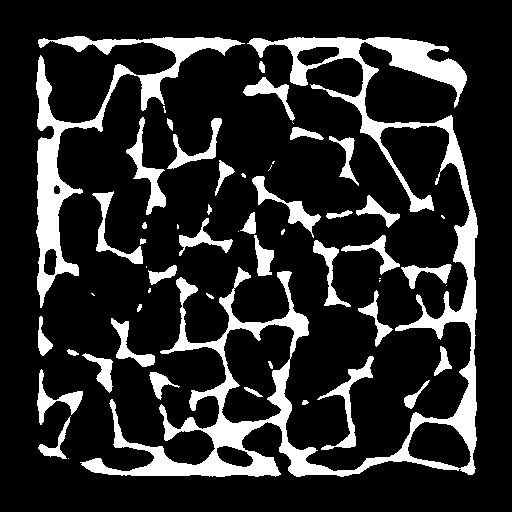
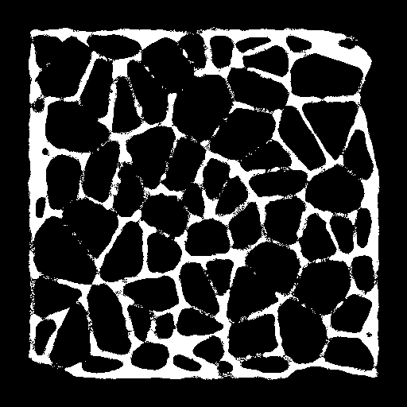
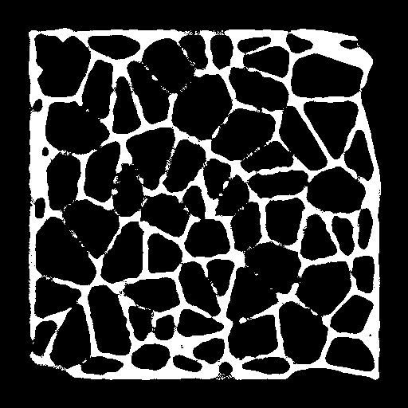
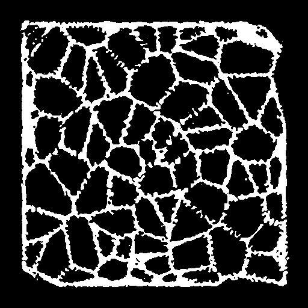
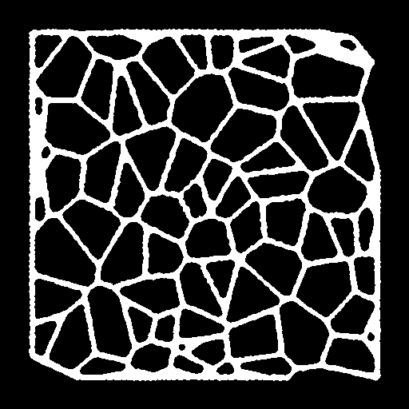
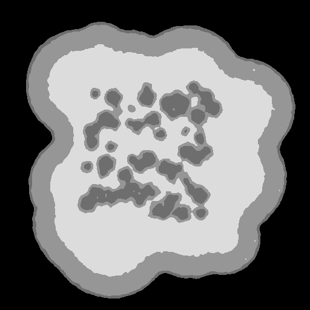

# DART_DisTomo
Discrete tomographic reconstruction techniques DART, SDART and SSIRT, implemented using sklearn and the astra toolbox.
Requires a functional Nvidia GPU to use, as the ASTRA implementations only use CUDA.

## References
#### [S-SIRT](https://doi.org/10.1109/TIP.2013.2297025):
Aarle, Wim & Batenburg, Kees & Van Gompel, Gert & Van de Casteele, Elke & Sijbers, Jan. (2014). Super-Resolution for Computed Tomography Based on Discrete Tomography. Image Processing, IEEE Transactions on. 23. 1181-1193. 10.1109/TIP.2013.2297025. 

#### [DART](https://doi.org/10.1109/TIP.2011.2131661):
Batenburg, Kees & Sijbers, Jan. (2011). DART: A Practical Reconstruction Algorithm for Discrete Tomography. IEEE transactions on image processing : a publication of the IEEE Signal Processing Society. 20. 2542-53. 10.1109/TIP.2011.2131661. 

#### [SDART](https://doi.org/10.1016/j.cviu.2014.06.002):
Bleichrodt, Folkert & Tabak, F. & Batenburg, Kees. (2014). SDART: An algorithm for discrete tomography from noisy projections. Computer Vision and Image Understanding. 129. 63–74. 10.1016/j.cviu.2014.06.002. 

## Required packages
Install required packages through `python-venv` or `uv`. `uv` is easier to use so that is recommended.

These instructions are for linux only, specifically debian.
### uv
1. Install `uv`:
    - `curl -LsSf https://astral.sh/uv/install.sh | sh`
    - uv is also availble on PyPi, so `pipx` and `pip` also works: `pip install uv`
2. Installing packages:
    - If you do not have any disk quotas, simply use: `uv sync`
    - If you DO have disk quotas, set a cache location for packages first: `export UV_CACHE_DIR=/etc/data_location_here/.cache/uv/`
3. Running python
    - Run scripts using: `uv run python -m source.<script>` for module packages.
    - Alternatively: `source .venv/bin/activate` followed by `python3 -m source.<script>` for module packages.
### venv + pip
1. Create a .venv:
`python3 -m venv .venv`
2. Activate the .venv:
`source .venv/bin/activate`
3. Install packages:
`pip install -r requirements.txt`

## Before running
Before running any experiments, generate the phantom images using:

- `uv run python -m source.phantoms.create_phantoms` or `python3 -m source.phantoms.create_phantoms`

## Running the experiments
All experiment routines can be found in `./source/experiments/`, and have to be run as modules:

- `./source/experiments/lambda_sdart.py` is the routine for the lambda smoothing parameter for SDART.
    
    - To run:
    `uv run python -m source.experiments.lambda_sdart`

    - The results will be saved in `./lambda_results.json`.

- `./source/experiments/p_dart.py` is the routine for the free_pixels sampling chance for DART.

    - To run:
    `uv run python -m source.experiments.p_dart`

- `./source/experiments/visualize_algs.py` is a routine for creating some images for each algorithm of the phantom `"./phantoms/meshes/mesh_7.png"` for four different DetectorSuperSampling `a` parameters. The number of detectors for sinogram sampling is set to `64` with `180` projection angles. These will be stored in `./visuals/` as PNGs.

    - To run:
    `uv run python -m source.experiments.visualize_algs`

- `./source/experiments/noisy_sdart.py` is a routine for quickly visualizing 2 reconstructions using SDART with added noise into the `./phantoms/bones/bone_5.png` phantoms. This shows that in the prescence of noise in the sinogram, having too many iterations for the internal lsqr actually has a negative effect for the reconstruction, especially if we apply DetectorSuperSampling.

  - To run:
  `uv run python -m source.experiments.noisy_sdart`

- `./source/experiments/run_all.py` is the script for running the complete experiments for all phantom images present in the `./phantoms/` directory. It will go through four `a` parameters for DetectorSuperSampling, `1, 4, 8` and `16` and take the mean `rNMP` and `SSIM` for each phantom family/group for each algorithm seperately. The sinograms are sampled using `64` detector elements, with the DetectorSuperSampling option during the sinogram sampling set to the same value as the detector element spacing. In the case of our experiments, this was `8`, as this makes the detector the same width as the phantoms, which was `512`. The script can be given two commandline options to change whether random poisson noise will be added to the sinogram or not.

    - To run using the original sinograms:
    `uv run python -m source.run_all`

        This will run all algorithms with clean sinograms.
    - To run using sinograms with added noise:
    `uv run python -m source.run_all noisy`

        This will add poisson noise using `astra.functions.add_noise_to_sino` with a background intensity of `1e5`.

## Phantoms
Here are some examples of what the phantoms will generally look like:
These are in order: "blob", "bone" and "mesh" phantom.

  

## Sample reconstructions
Here are some sample reconstructions of the example mesh phantom.

#### S-SIRT with DetectorSuperSampling `1` and `4`:
 

#### DART with DetectorSuperSampling `1` and `4`:
  

#### SDART with DetectorSuperSampling `1` and `4`:
 

## Reconstruction showing off SDART overestimation with noisy bone phantom
#### SDART with internal lsqr reconstruction iterations set to `25` and `100` under the effects of sinogram noise.
 

## Results
<table>
  <caption>
    Average <strong>rNMP</strong> &amp; <strong>SSIM</strong> values for each phantom type
    across different algorithms with different up-sampling settings.
  </caption>
  <thead>
    <tr>
      <th rowspan="2">Phantom type</th>
      <th rowspan="2">a value</th>
      <th colspan="3"><strong>rNMP</strong></th>
      <th colspan="3"><strong>SSIM</strong></th>
    </tr>
    <tr>
      <th>S-SIRT</th>
      <th>DART</th>
      <th>S-DART</th>
      <th>S-SIRT</th>
      <th>DART</th>
      <th>S-DART</th>
    </tr>
  </thead>
  <tbody>
    <tr>
      <td rowspan="4">Mesh</td>
      <td>1</td>
      <td>0.0762</td>
      <td>0.0708</td>
      <td>0.0607</td>
      <td>0.7586</td>
      <td>0.7681</td>
      <td>0.7664</td>
    </tr>
    <tr>
      <td>4</td>
      <td>0.0668</td>
      <td>0.0550</td>
      <td>0.0174</td>
      <td>0.7759</td>
      <td>0.8034</td>
      <td>0.9123</td>
    </tr>
    <tr>
      <td>8</td>
      <td>0.0666</td>
      <td>0.0545</td>
      <td>0.0159</td>
      <td>0.7763</td>
      <td>0.8045</td>
      <td>0.9198</td>
    </tr>
    <tr>
      <td>16</td>
      <td>0.0665</td>
      <td>0.0546</td>
      <td><strong>0.0157</strong></td>
      <td>0.7764</td>
      <td>0.8041</td>
      <td><strong>0.9207</strong></td>
    </tr>
    <tr>
      <td rowspan="4">Bone</td>
      <td>1</td>
      <td>0.0972</td>
      <td>0.0925</td>
      <td>0.0794</td>
      <td>0.8521</td>
      <td>0.8551</td>
      <td>0.8635</td>
    </tr>
    <tr>
      <td>4</td>
      <td>0.0910</td>
      <td>0.0841</td>
      <td>0.0401</td>
      <td>0.8594</td>
      <td>0.8663</td>
      <td>0.9224</td>
    </tr>
    <tr>
      <td>8</td>
      <td>0.0908</td>
      <td>0.0838</td>
      <td>0.0386</td>
      <td>0.8596</td>
      <td>0.8665</td>
      <td>0.9233</td>
    </tr>
    <tr>
      <td>16</td>
      <td>0.0908</td>
      <td>0.0838</td>
      <td><strong>0.0383</strong></td>
      <td>0.8597</td>
      <td>0.8668</td>
      <td><strong>0.9234</strong></td>
    </tr>
    <tr>
      <td rowspan="4">Blob</td>
      <td>1</td>
      <td>0.0111</td>
      <td>0.0097</td>
      <td>0.0128</td>
      <td>0.9611</td>
      <td>0.9658</td>
      <td>0.9484</td>
    </tr>
    <tr>
      <td>4</td>
      <td>0.0104</td>
      <td>0.0088</td>
      <td>0.0054</td>
      <td>0.9627</td>
      <td>0.9688</td>
      <td>0.9764</td>
    </tr>
    <tr>
      <td>8</td>
      <td>0.0104</td>
      <td>0.0087</td>
      <td>0.0048</td>
      <td>0.9628</td>
      <td>0.9688</td>
      <td>0.9794</td>
    </tr>
    <tr>
      <td>16</td>
      <td>0.0104</td>
      <td>0.0087</td>
      <td><strong>0.0047</strong></td>
      <td>0.9627</td>
      <td>0.9688</td>
      <td><strong>0.9798</strong></td>
    </tr>
  </tbody>
</table>
<table>
  <caption>
    Average <strong>rNMP</strong> &amp; <strong>SSIM</strong> values for each phantom type
    across different algorithms with different up-sampling settings, with the inclusion
    of Poisson noise to the phantoms.
  </caption>
  <thead>
    <tr>
      <th rowspan="2">Phantom type</th>
      <th rowspan="2">a value</th>
      <th colspan="3"><strong>rNMP</strong></th>
      <th colspan="3"><strong>SSIM</strong></th>
    </tr>
    <tr>
      <th>S-SIRT</th>
      <th>DART</th>
      <th>S-DART</th>
      <th>S-SIRT</th>
      <th>DART</th>
      <th>S-DART</th>
    </tr>
  </thead>
  <tbody>
    <tr>
      <td rowspan="4">Mesh</td>
      <td>1</td>
      <td>0.0765</td>
      <td>0.0705</td>
      <td>0.0612</td>
      <td>0.7581</td>
      <td>0.7688</td>
      <td>0.7648</td>
    </tr>
    <tr>
      <td>4</td>
      <td>0.0670</td>
      <td>0.0552</td>
      <td><strong>0.0238</strong></td>
      <td>0.7754</td>
      <td>0.8028</td>
      <td><strong>0.8857</strong></td>
    </tr>
    <tr>
      <td>8</td>
      <td>0.0668</td>
      <td>0.0553</td>
      <td>0.0247</td>
      <td>0.7757</td>
      <td>0.8026</td>
      <td>0.8819</td>
    </tr>
    <tr>
      <td>16</td>
      <td>0.0668</td>
      <td>0.0551</td>
      <td>0.0244</td>
      <td>0.7758</td>
      <td>0.8033</td>
      <td>0.8834</td>
    </tr>
    <tr>
      <td rowspan="4">Bone</td>
      <td>1</td>
      <td>0.0980</td>
      <td>0.0935</td>
      <td><strong>0.0828</strong></td>
      <td>0.8497</td>
      <td>0.8521</td>
      <td>0.8491</td>
    </tr>
    <tr>
      <td>4</td>
      <td>0.0919</td>
      <td>0.0852</td>
      <td>0.0850</td>
      <td>0.8568</td>
      <td>0.8629</td>
      <td>0.7818</td>
    </tr>
    <tr>
      <td>8</td>
      <td>0.0917</td>
      <td>0.0849</td>
      <td>0.0980</td>
      <td>0.8570</td>
      <td>0.8630</td>
      <td>0.7583</td>
    </tr>
    <tr>
      <td>16</td>
      <td>0.0916</td>
      <td>0.0848</td>
      <td>0.1002</td>
      <td>0.8571</td>
      <td><strong>0.8633</strong></td>
      <td>0.7543</td>
    </tr>
    <tr>
      <td rowspan="4">Blob</td>
      <td>1</td>
      <td>0.0114</td>
      <td>0.0103</td>
      <td>0.0150</td>
      <td>0.9597</td>
      <td>0.9631</td>
      <td>0.9395</td>
    </tr>
    <tr>
      <td>4</td>
      <td>0.0108</td>
      <td>0.0094</td>
      <td>0.0121</td>
      <td>0.9612</td>
      <td>0.9658</td>
      <td>0.9440</td>
    </tr>
    <tr>
      <td>8</td>
      <td>0.0108</td>
      <td>0.0094</td>
      <td>0.0126</td>
      <td>0.9612</td>
      <td>0.9658</td>
      <td>0.9411</td>
    </tr>
    <tr>
      <td>16</td>
      <td>0.0108</td>
      <td><strong>0.0093</strong></td>
      <td>0.0125</td>
      <td>0.9612</td>
      <td><strong>0.9659</strong></td>
      <td>0.9414</td>
    </tr>
  </tbody>
</table>
<table>
  <caption>
    Average <strong>rNMP</strong> &amp; <strong>SSIM</strong> values for each phantom family for DART,
    changing the <em>p</em> parameter that signifies the probability a pixel is sampled as a fixed pixel
    in the DART reconstruction.
  </caption>
  <thead>
    <tr>
      <th>Phantom type</th>
      <th>p-value</th>
      <th>rNMP</th>
      <th>SSIM</th>
    </tr>
  </thead>
  <tbody>
    <tr>
      <td rowspan="4">Mesh</td>
      <td>0.1</td>
      <td>0.0664</td>
      <td>0.7768</td>
    </tr>
    <tr>
      <td>0.2</td>
      <td>0.0591</td>
      <td>0.7924</td>
    </tr>
    <tr>
      <td>0.4</td>
      <td><strong>0.0707</strong></td>
      <td><strong>0.7685</strong></td>
    </tr>
    <tr>
      <td>0.8</td>
      <td>0.0806</td>
      <td>0.7201</td>
    </tr>
    <tr>
      <td rowspan="4">Bone</td>
      <td>0.1</td>
      <td>0.0961</td>
      <td>0.8529</td>
    </tr>
    <tr>
      <td>0.2</td>
      <td>0.0949</td>
      <td>0.8539</td>
    </tr>
    <tr>
      <td>0.4</td>
      <td><strong>0.0926</strong></td>
      <td><strong>0.8549</strong></td>
    </tr>
    <tr>
      <td>0.8</td>
      <td>0.0893</td>
      <td>0.8478</td>
    </tr>
    <tr>
      <td rowspan="4">Blob</td>
      <td>0.1</td>
      <td>0.0106</td>
      <td>0.9628</td>
    </tr>
    <tr>
      <td>0.2</td>
      <td>0.0102</td>
      <td>0.9644</td>
    </tr>
    <tr>
      <td>0.4</td>
      <td><strong>0.0098</strong></td>
      <td><strong>0.9655</strong></td>
    </tr>
    <tr>
      <td>0.8</td>
      <td>0.0168</td>
      <td>0.9298</td>
    </tr>
  </tbody>
</table>

<table>
  <caption>
    Average <strong>rNMP</strong> &amp; <strong>SSIM</strong> values for each phantom family for the SDART recreation,
    changing the value of the <em>&lambda;</em> smoothing parameter to see which one works about the best.
  </caption>
  <thead>
    <tr>
      <th>Phantom type</th>
      <th>&lambda;</th>
      <th>rNMP</th>
      <th>SSIM</th>
    </tr>
  </thead>
  <tbody>
    <tr>
      <td rowspan="4">Mesh</td>
      <td>0.1</td>
      <td><strong>0.0607</strong></td>
      <td><strong>0.7664</strong></td>
    </tr>
    <tr>
      <td>0.24</td>
      <td>0.0699</td>
      <td>0.7326</td>
    </tr>
    <tr>
      <td>0.48</td>
      <td>0.0756</td>
      <td>0.7138</td>
    </tr>
    <tr>
      <td>0.8</td>
      <td>0.0693</td>
      <td>0.7410</td>
    </tr>
    <tr>
      <td rowspan="4">Bone</td>
      <td>0.1</td>
      <td><strong>0.0794</strong></td>
      <td><strong>0.8635</strong></td>
    </tr>
    <tr>
      <td>0.24</td>
      <td>0.0817</td>
      <td>0.8526</td>
    </tr>
    <tr>
      <td>0.48</td>
      <td>0.0846</td>
      <td>0.8432</td>
    </tr>
    <tr>
      <td>0.8</td>
      <td>0.0821</td>
      <td>0.8603</td>
    </tr>
    <tr>
      <td rowspan="4">Blob</td>
      <td>0.1</td>
      <td><em>0.0126</em></td>
      <td><em>0.9484</em></td>
    </tr>
    <tr>
      <td>0.24</td>
      <td>0.0178</td>
      <td>0.9263</td>
    </tr>
    <tr>
      <td>0.48</td>
      <td>0.0224</td>
      <td>0.9083</td>
    </tr>
    <tr>
      <td>0.8</td>
      <td><strong>0.0102</strong></td>
      <td><strong>0.9613</strong></td>
    </tr>
  </tbody>
</table>
